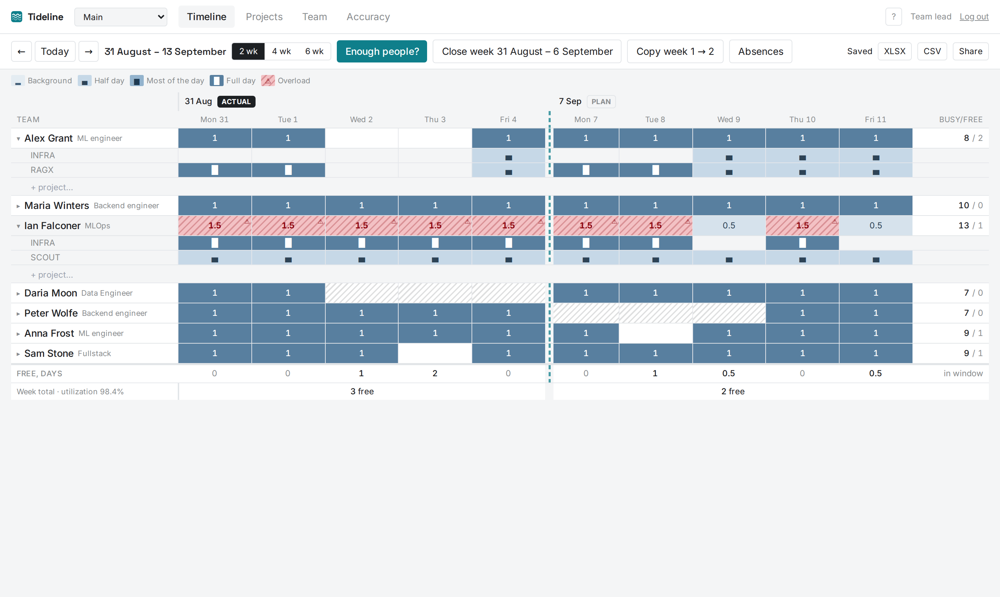
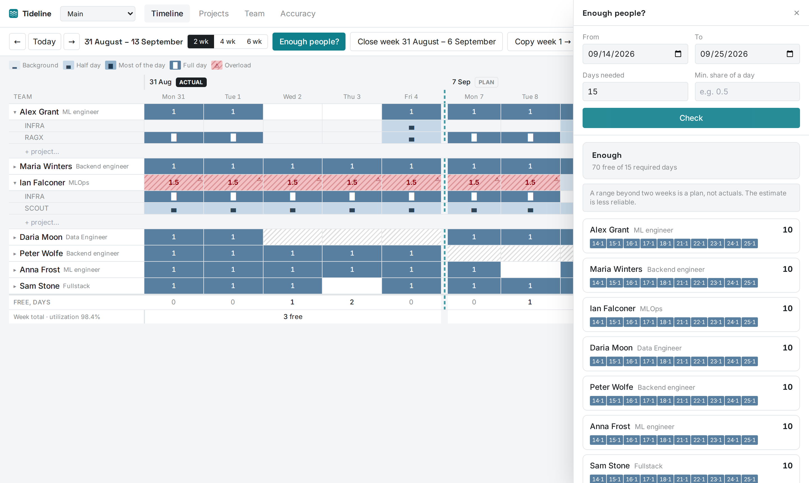
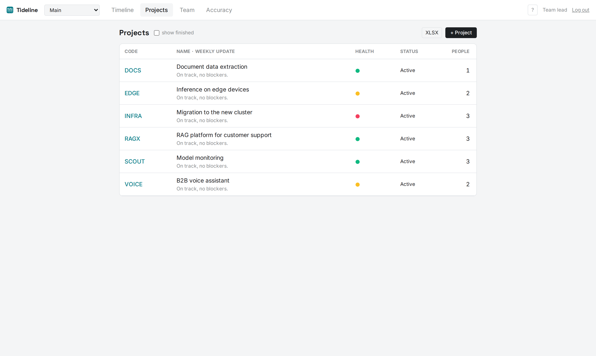
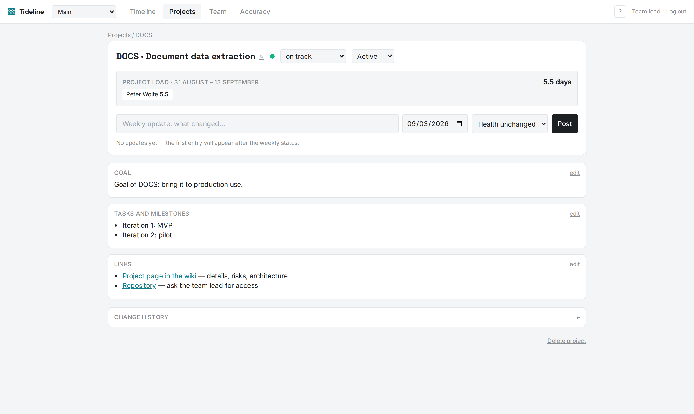
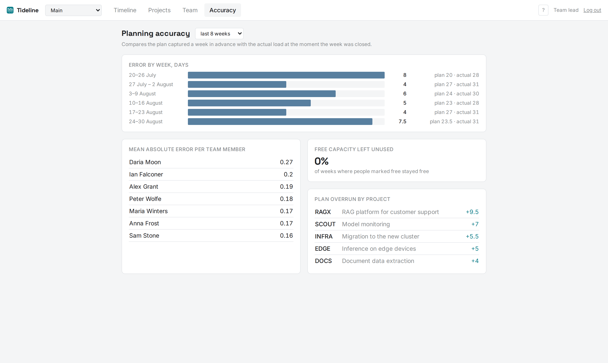
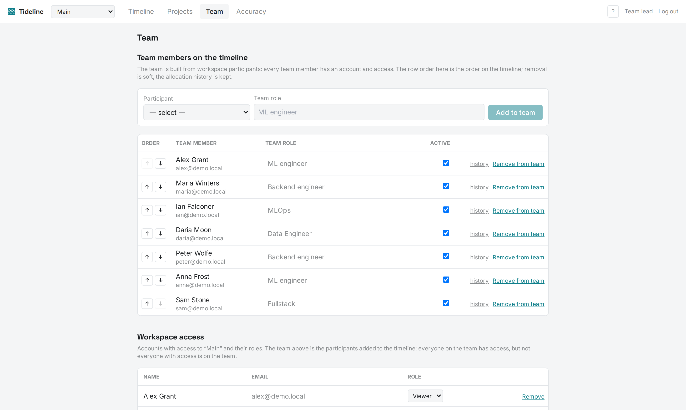
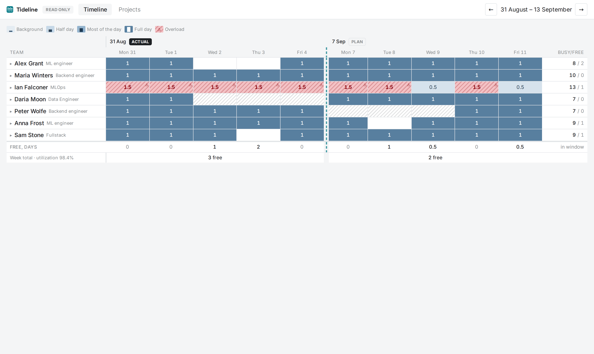
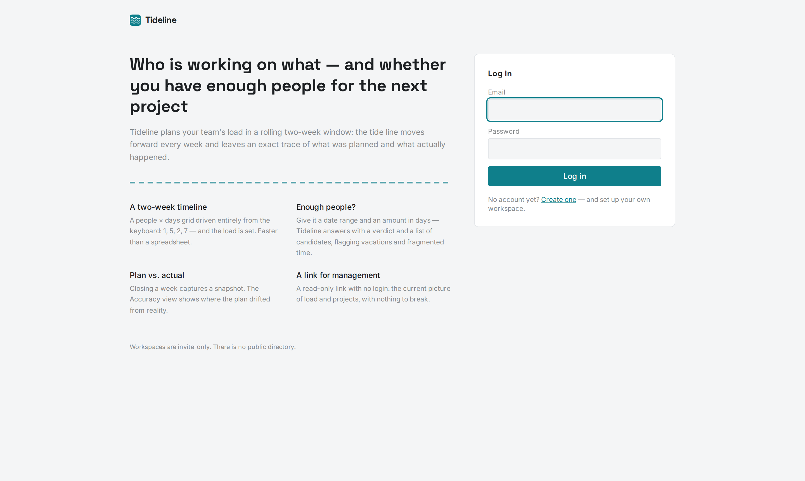
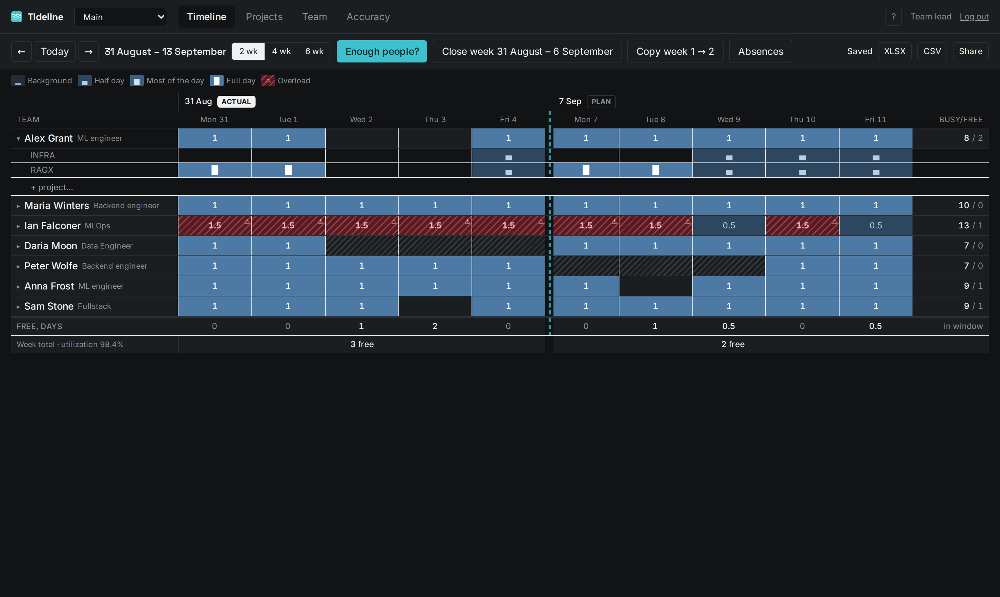

<p align="center">
  
</p>

<h1 align="center">Tideline</h1>

<p align="center">
  Team load planning on a rolling two-week timeline.<br/>
  Who is working on what, who is free and by how much, and whether there are enough people to start the next project.
</p>

<p align="center">
  <a href="#quick-start">Quick start</a> ·
  <a href="#screenshots">Screenshots</a> ·
  <a href="#architecture">Architecture</a> ·
  <a href="docs/SPEC.md">Specification</a> ·
  <a href="docs/DECISIONS.md">Decisions (ADRs)</a>
</p>

---

## Why Tideline exists

A small engineering team (5–15 people) usually runs several projects at once. Management needs two things to be visible at all times:

1. **What each person is working on**, on which days, and on which project.
2. **Who is free, and by how much, in a given date range**, so that the question *"I want to start a project in two weeks, do we have the people?"* has a real answer with names in it.

Most teams do this in a spreadsheet. It works, but it costs manual effort every week (inserting rows, shifting weeks, adding projects) and it cannot search for free capacity. Planning horizons are short: on week N you plan weeks N and N+1; on week N+1 you correct N+1 and add N+2. The window slides forward one week at a time, and every slide leaves a new pattern behind, like a tideline on a beach.

Tideline replaces the spreadsheet with a web app in which:

- entering a week of load for the whole team takes **under two minutes, keyboard only**;
- *"do we have 15 person-days between the 3rd and the 14th?"* is answered by **one panel with concrete names**;
- closing a week is **one button** that snapshots the actual load into history;
- managers see the current picture through a **read-only link, without logging in**;
- a **plan vs. actual** screen shows where the plan drifted, so the team can calibrate its estimates.

## What it does

### Timeline
The main screen. Rows are team members, columns are working days (weekends and workspace holidays are hidden and excluded from capacity). Each person is a collapsible block: collapsed shows one row with total daily load; expanded shows one row per project plus a total.

Load is entered as one of **four categories**, not numbers: **Background** (¼ day), **Half day** (½), **Most of the day** (¾), **Full day** (1). Colour encodes only the load level, never the project. Overload (more than one full day) is legal and is highlighted, not hidden. Absences (vacation, sick leave) are hatched and set the day's capacity to zero.

Editing feels like a spreadsheet: click a cell, press a hotkey (`1` full, `5` half, `7` most, `2` background, `0`/`Delete` clear), move with arrows, `Tab` and `Enter`, drag the fill handle horizontally, select a rectangle and set one value for all of it, undo and redo up to 50 steps. Every change is saved optimistically with no "Save" button.

Weeks are separated by a gap with a dashed **tideline**: closed weeks (actual) on one side, open weeks (plan) on the other.

### Enough people?
The panel the product exists for. Input: a date range, the required volume in person-days, optional skill tags and a minimum share per person. Output: total free capacity, the verdict **Enough / Not enough** with the shortfall, and a list of candidates sorted by free capacity with a per-day breakdown and warnings: **sole expert** on an active project, absence inside the range, plan-only estimate beyond the two-week window.

### Projects and project cards
A registry of projects with code, name, lifecycle (**Active / Support / Finished**), health light (green / amber / red) and the latest weekly update. Each project card has a goal, tasks and milestones, links, a log of dated updates, and a load widget showing who is on the project in the current window and for how many person-days. Finished projects are hidden from pickers but kept in history.

### Close week and accuracy
**Close week** snapshots the week's allocations into an immutable JSON payload and moves the window forward. The plan for a week is captured the first time it is filled in, so the **Accuracy** screen can compare plan and actual per person and per project over the last N weeks. A closed week can be reopened.

### Workspaces, roles and sharing
Several workspaces per user with a switcher in the header. Roles per workspace: **owner** (everything), **editor** (allocations, absences, calendar, projects, week close, team), **viewer** (read only). People join through invite links with a default role. A **read-only share link** (`/s/{token}`) opens the timeline and projects for anyone with the URL, no account required; links can be revoked.

### Team
Team members are workspace participants: a timeline row is always backed by an account. Role, skill tags, ordering, absences and non-working days are managed here, together with participants, invite links and share links.

### Operations
Export the current window to **XLSX / CSV** and the registry to XLSX. Every mutation is written to an **audit log** with the old and new value. Encrypted, verified **backups** to an S3-compatible bucket, health and readiness endpoints, Prometheus metrics, structured JSON logs and optional Sentry.

## Screenshots

**Timeline** — people × working days, two weeks, categories as glyphs, overload hatched in red, absences hatched in grey. The dashed teal line is the tideline between the closed (actual) and open (plan) weeks.



**Enough people?** — a date range and a volume in person-days in, a verdict and ranked candidates with per-day free capacity out.



| Projects registry | Project card |
|---|---|
|  |  |

| Planning accuracy | Team and access |
|---|---|
|  |  |

| Read-only share link (no login) | Landing page |
|---|---|
|  |  |

**Dark theme** follows the OS setting.



## Quick start

Requirements: Python 3.12+, [uv](https://github.com/astral-sh/uv), Node 20+.

```bash
make setup                     # uv venv + pip install -e ".[dev]", npm install
cp .env.example backend/.env   # SQLite by default; no edits needed for a local run
make migrate                   # alembic upgrade head
make seed                      # demo data: 7 people, 8 projects, 8 weeks of load
make backend                   # API on http://localhost:8000
make frontend                  # Vite dev server on http://localhost:5173 (proxies /api)
```

Log in with `ADMIN_EMAIL` / `ADMIN_PASSWORD` from the env (defaults: `admin@example.com` / `admin`). The landing page also lets anyone create an account with their own empty workspace. Demo team members are `<first-name>@demo.local` / `demo-password-123` with the viewer role.

Single-process production mode: `make build && make backend` builds the frontend into `backend/static` and FastAPI serves it as an SPA fallback.

### Keyboard shortcuts

| Key | Action |
|---|---|
| `1` `5` `7` `2` | Full day · Half day · Most of the day · Background |
| `0` / `Delete` | Clear |
| Arrows / `Tab` / `Enter` | Move like in a spreadsheet |
| `Shift` + arrows / mouse drag | Rectangular selection |
| Fill handle (cell corner) | Drag-fill horizontally |
| `Cmd/Ctrl+Z` / `+Shift+Z` | Undo / redo (50 steps) |
| `?` | Shortcut help |

### Tests

```bash
make test                              # backend: pytest with coverage of app/domain
cd frontend && npm test                # vitest: timeline grid
cd frontend && npx playwright test     # E2E: builds a clean SQLite DB, seeds it, drives the UI
```

## Architecture

One deployable unit: FastAPI serves the REST API under `/api/v1` and the built React app as an SPA fallback. PostgreSQL is the only store (SQLite for local development and tests). Backup jobs run the same Docker image on a schedule.

```
browser ── /              → static React SPA
        ── /api/v1/*      → FastAPI, httpOnly cookie session
        ── /api/v1/s/*    → public read-only endpoints (token in path)
        ── /healthz /readyz /metrics

FastAPI ── SQLAlchemy 2 (async) ── PostgreSQL
cron: backup.py ── pg_dump + JSON export → age encryption → S3 bucket (outside the app host)
cron: verify_backup.py ── S3 → temporary DB → integrity checks → .verified marker
```

### Backend (`backend/app`)

| Package | Responsibility |
|---|---|
| `api/v1/` | Thin routers: validation, call the domain, write audit. All domain routes live under `/api/v1/w/{workspace_slug}/…` |
| `core/` | Settings (pydantic-settings), signed cookie sessions (itsdangerous), argon2 passwords, rate limiting, security headers, request-id logging |
| `db/` | SQLAlchemy models and async session factory. **Every table carries `workspace_id`**; unique keys and indexes include it |
| `domain/` | Business logic with no FastAPI imports: `capacity` (free capacity and candidate search), `timeline` (grid aggregate), `week_close` (snapshots and reopen), `accuracy` (plan vs. actual), `categories` (load weights), `calendar` |
| `services/` | XLSX/CSV export (openpyxl), audit log, backup access |
| `alembic/` | Schema migrations |

Data model (all tables are workspace-scoped): `workspace`, `app_user`, `membership`, `member`, `project`, `project_update`, `milestone`, `allocation`, `absence`, `non_working_day`, `week_snapshot`, `share_link`, `invite_link`, `audit_log`.

Key data decisions:

- **Days are `date`, not `timestamp`.** A planning day is a calendar day in the workspace's time zone; timestamps are a classic source of off-by-one-day bugs.
- **Load is a category.** `allocation.category ∈ {background, half, most, full}`; weights (¼ ½ ¾ 1) live in one place, `app/domain/categories.py`, and all aggregates are computed from them. The daily sum is not capped: overload is shown, not forbidden.
- **Week snapshots are self-contained JSON.** History must not change retroactively when a project is renamed or a person leaves, so plan vs. actual is computed from snapshots, not live tables.
- **Soft delete** for people and projects; **audit log** with before/after values on every mutation.
- **Tokens are hashed.** Share and invite tokens are stored as SHA-256 with a short display prefix; a leaked DB dump does not leak working links.
- **A team member is a participant.** Every timeline row references an account; revoking access soft-deletes the row and keeps its history.

`GET /timeline` builds the window with a fixed number of queries regardless of team size (no N+1).

### Frontend (`frontend/src`)

- React 18 + TypeScript + Vite + Tailwind. TanStack Query holds server state.
- `components/timeline/` is a hand-written CSS Grid, not a generic data grid (see ADR-1): keyboard model, drag-fill handle, rectangular selection, collapsible member blocks with nested project rows, read-only mode for share links. All grid edits are optimistic: aggregates are recomputed locally, then `POST /allocations/bulk`; on error the query is invalidated and the server wins.
- `features/capacity-search/` is the "Enough people?" panel; `features/` also holds absences, access management, share links and audit history.
- `pages/` are the screens: Timeline, Projects, Project card, Team, Accuracy, Workspaces, public Share page, Landing, Login, Register, Join.
- Typography: Inter for UI text and Space Grotesk for the wordmark, self-hosted under `public/fonts` (SIL Open Font License). Light and dark themes follow the OS.

### Observability and operations

- Structured JSON logs with `request_id`; `/healthz` (process up), `/readyz` (DB reachable), `/metrics` (Prometheus, including `backup_last_success_timestamp`).
- Backups: `pg_dump -Fc` plus a JSON export of every table, encrypted with [age](https://age-encryption.org), pushed to an S3-compatible bucket with 7/4/6 rotation, restored and verified weekly, and taken before every deploy (a failed backup blocks the deploy). See [docs/RESTORE.md](docs/RESTORE.md).

## Deployment

- **Railway**: one `web` service built from the `Dockerfile` (config in `railway.toml`), managed Postgres, two cron services for backups. Guide: [docs/DEPLOY-RAILWAY.md](docs/DEPLOY-RAILWAY.md).
- **Any Linux VM with Docker Compose**: Caddy (automatic TLS) + app + Postgres + backup cron. Files in `ops/compose/`, guide: [docs/DEPLOY-DOCKER.md](docs/DEPLOY-DOCKER.md).

Configuration is environment-only; see [.env.example](.env.example). Generate your own `SECRET_KEY` and backup keys; nothing in the repository should be used as a real secret.

## Repository layout

```
backend/    FastAPI app: api/v1, core, db, domain, services, alembic, tests
frontend/   React app: components/timeline, features, pages, e2e (Playwright)
ops/        backup.py, verify_backup.py, restore.sh, compose/ (Docker Compose + Caddy)
docs/       SPEC.md, ARCHITECTURE.md, DECISIONS.md, DEMO.md, RESTORE.md, DEPLOY-*.md, ITERATION-2.md
```

## Documentation

- [docs/SPEC.md](docs/SPEC.md): the original product and technical specification.
- [docs/ARCHITECTURE.md](docs/ARCHITECTURE.md): components, data model, observability.
- [docs/DECISIONS.md](docs/DECISIONS.md): architecture decision records (own grid, single service, workspace_id from day one, dates not timestamps, JSON snapshots, hashed tokens, off-host backups, member = participant).
- [docs/DEMO.md](docs/DEMO.md): a walkthrough of the demo data.
- [docs/RESTORE.md](docs/RESTORE.md): what to do when something breaks.

## Fonts

Inter and Space Grotesk are bundled under the SIL Open Font License (see `frontend/public/fonts/`).
